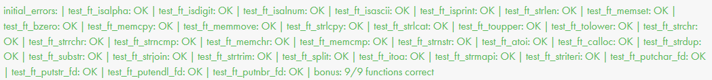

<p align="center">
  
</p>
<h3 align="center">
  <em>Your very first own library</em>
</h3>

---

## ⚠️ Disclaimer

- **Full Portfolio:** This repository focuses on this specific project. You can find my entire 42 curriculum 👉 [here](https://github.com/Overtekk/42).
- **Subject Rules:** I strictly follow the rules regarding 42 subjects; I cannot share the PDFs, but I explain the concepts in this README.
- **Archive State:** The code is preserved exactly as it was during evaluation (graded state). I do not update it, so you can see my progress and mistakes from that time.
- **Academic Integrity:** I encourage you to try the project yourself first. Use this repo only as a reference, not for copy-pasting. Be patient, you will succeed.

## 📂 Purpose

**Libft** is the cornerstone of the 42 curriculum. Its goal is to build a custom C library that will be used in almost every future project.

Since we are not allowed to use most standard C libraries (like `<string.h>` or `<stdlib.h>`) in our exercises, we must rewrite these functions **from scratch**.
We will learn how to create a `Makefile` to automate compilation and generate a **static library** (`libft.a`). Also, organizing code efficiently using header files (`.h`) to declare prototypes and structures.

**⚠️ Evolution & Reliability:**
This library is designed to grow. In the future, you will add more functions, either required by other projects or for your own utility. Therefore, your code must be rock-solid: **no memory leaks, no segmentation faults, and correct return values**. Treat this project as the most important asset in your curriculum.

## 🐨 Status

Completed on **27/10/2025** with bonus.
<p align="left">
  
  &nbsp;&nbsp;
  
</p>

## 🔷 Usage

- First, clone this repository.

`make` to compile mandatory functions.\
`make bonus` to compile bonus functions.

I have provided a complete `main` to test all functions. You can run it using this command:\
```cc -Wall -Werror -Wextra main/main.c libft.a && ./a.out```\
Enter the number of the function you want to test *(ex: 1 for ft_isalpha)*, then follow the instructions.

A main without bonus dependencies is also available. Use `main_no_bonus.c` instead.

⚠️ **Note:** The compilation will fail if some functions are missing from your library.

## 🖱️ Function list

### 🧱 Memory
| Function | Function |
| :--- | :--- |
| `ft_memset` | `ft_memchr` |
| `ft_bzero` | `ft_memcmp` |
| `ft_memcpy` | `ft_calloc` |
| `ft_memmove` | `ft_strdup` |

### 🔡 String Manipulation
| Function | Function | Function |
| :--- | :--- | :--- |
| `ft_strlen` | `ft_strncmp` | `ft_split` |
| `ft_strlcpy` | `ft_strnstr` | `ft_strmapi` |
| `ft_strlcat` | `ft_substr` | `ft_striteri` |
| `ft_strchr` | `ft_strjoin` | |
| `ft_strrchr` | `ft_strtrim` | |

### 🔢 Converters & Checkers
| Function | Function |
| :--- | :--- |
| `ft_isalpha` | `ft_toupper` |
| `ft_isdigit` | `ft_tolower` |
| `ft_isalnum` | `ft_atoi` |
| `ft_isascii` | `ft_itoa` |
| `ft_isprint` | |

### 📠 File Descriptor
| Function |
| :--- |
| `ft_putchar_fd` |
| `ft_putstr_fd` |
| `ft_putendl_fd` |
| `ft_putnbr_fd` |

### ⛓️ Linked List (Bonus)
| Function | Function |
| :--- | :--- |
| `ft_lstnew` | `ft_lstdelone` |
| `ft_lstadd_front` | `ft_lstclear` |
| `ft_lstsize` | `ft_lstiter` |
| `ft_lstlast` | `ft_lstmap` |
| `ft_lstadd_back` | |

---
